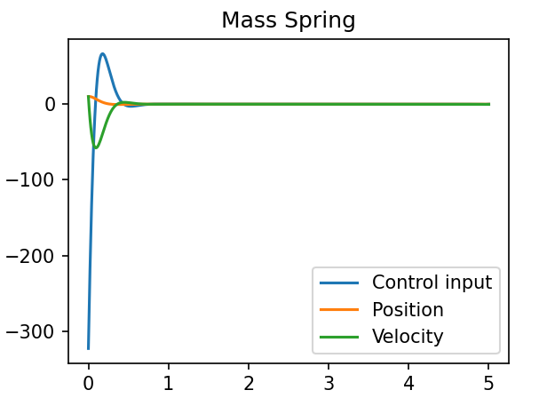

# Differential Dynamic Programming

Differential Dynamic Programming (DDP), originally introduced by [David Maybe in 1966](https://www.tandfonline.com/doi/abs/10.1080/00207176608921369), is one of the earliest trajectory optimization methods in the field of optimal control. It builds on Dynamic Programming, but instead of optimizing across the entire state space, DDP focuses on optimizing around a reference trajectory using second-order Taylor expansions. Iterating this process enables finding local solutions to non-linear trajectory optimization problems.

Despite its conceptual simplicity, DDP is remarkably effective. More recently, it was rediscovered, simplified into [iLQR](https://homes.cs.washington.edu/~todorov/papers/TassaIROS12.pdf), and demonstrated in advanced humanoid behaviors.

This repository offers an educational DDP implementation, complementing this [blog post](http://www.imgeorgiev.com/2023-02-01-ddp/). It relies heavily on the powerful sympy package for symbolic derivative computation. While the implementation prioritizes clarity and ease of use over speed, it is a great resource for learning and understanding DDP.

### Visualiztion of DDP iterations on a mass-spring system

